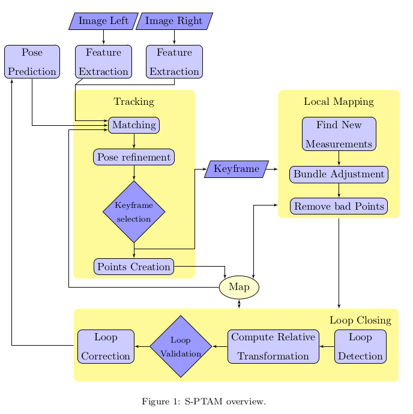

Python implementation of the Stereo PTAM (parallel tracking and mapping), See the paper: "[S-PTAM: Stereo Parallel Tracking and Mapping](docs/S-PTAM: Stereo Parallel Tracking and Mapping.pdf) Taihu Pire et al. RAS17"

Example of S-PTAM on KITTI dataset  

## Requirements
* Python 3.6+
* cv2
* numpy
* [g2o](https://github.com/uoip/g2opy) (python binding of C++ library [g2o](https://github.com/RainerKuemmerle/g2o)) for BA and pose graph optimization
* [pangolin](https://github.com/uoip/pangolin) (python binding of C++ library [Pangolin](http://github.com/stevenlovegrove/Pangolin)) for visualization

## Features 
* Multithreads Tracking, Mapping, and Loop Closing;
* Covisibility Graph (representing the relation between keyframes, mappoints and measurements);
* Local Bundle Adjustment and Pose Graph Optimization;
* Motion Model (used for pose prediction, then for reliable feature matching);
* Point Clouds and Graph visualization;

## Usage
`python3 main.py`  
 

## System overview :  

